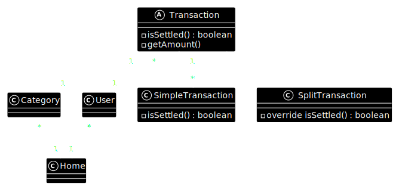

# Tech Stack & Tools

- Vuejs (frontend)
- Laravel (backend)
- Inertia to bind Vuejs and Laravel
- Vite
- Docker: Everything in the dev environment runs inside docker containers
- Linting/Formatting
    - Eslint for typescript/javascript/Vue
    - Pint for Laravel/php
    - Prettier for formatting most files
- Make: for simplifying commands. _`make setup` and `make destroy` are your best friends_

# Model

# Documentation

PlantUML is used for generating diagrams. See makefile and
`/doc/diagrams/README.md` for more info
